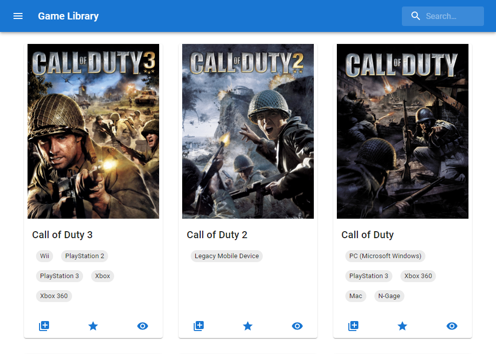

# game-library

A personal project that help me to keep track of my owned videogames on different platforms.  

# Start on local

1. Clone or fork and clone the repository
2. Run `yarn install`
3. Follow these doc's to get `client_id` and `client_secret` for igdb -> https://api-docs.igdb.com/#getting-started
4. Copy `config.sample.ts` to a new file `config.ts` and fill out `client_id` and `client_secret`
5. Run `yarn electron:dev`

# Got an idea or found a bug?

Please feel free to write it down in the [issue](https://github.com/MetalCar/game-library/issues) tab.

# Contribute

Everyone can contribute to this at any time, but please fork this repository and create a pull request to this repository.
